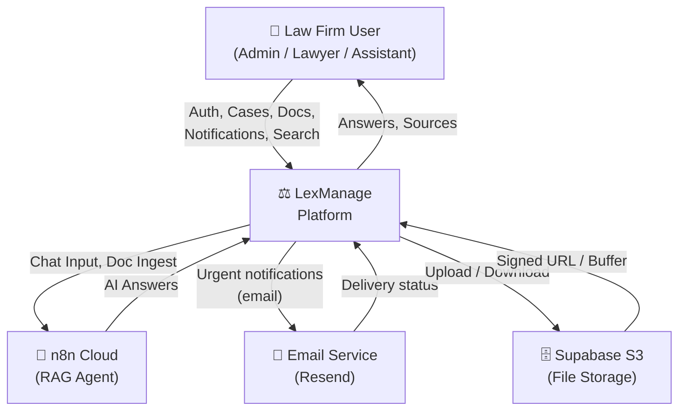
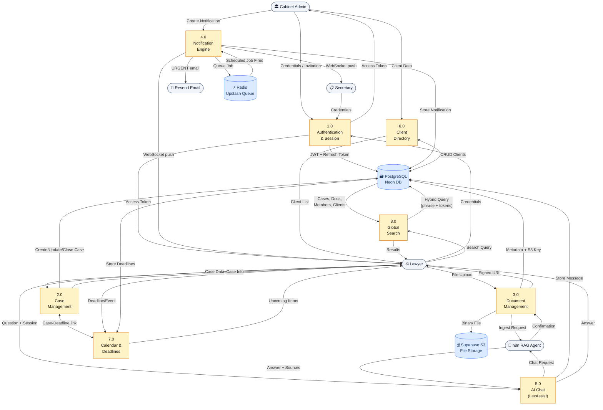

# Data Flow Diagram — LexManage

## Level 0 — Context Diagram

```mermaid
flowchart TB
    User["👤 Law Firm User\n(Admin / Lawyer / Assistant)"]
    n8n["🤖 n8n Cloud\n(RAG Agent)"]
    Email["📧 Email Service\n(Resend)"]
    S3["🗄️ Supabase S3\n(File Storage)"]

    User -->|"Auth, Cases, Docs,\nNotifications, Search"| LexManage["⚖️ LexManage\nPlatform"]
    LexManage -->|"Answers, Sources"| User
    LexManage -->|"Chat Input, Doc Ingest"| n8n
    n8n -->|"AI Answers"| LexManage
    LexManage -->|"Urgent notifications\n(email)"| Email
    Email -->|"Delivery status"| LexManage
    LexManage -->|"Upload / Download"| S3
    S3 -->|"Signed URL / Buffer"| LexManage
```

---

## Level 1 — Detailed Data Flow

```mermaid
flowchart TD
    %% External Entities
    Admin(["🏛️ Cabinet Admin"])
    Lawyer(["⚖️ Lawyer"])
    Secretary(["📋 Secretary"])
    n8nAgent(["🤖 n8n RAG Agent"])
    EmailSvc(["📧 Resend Email"])

    %% Processes
    P1["1.0\nAuthentication\n& Session"]
    P2["2.0\nCase\nManagement"]
    P3["3.0\nDocument\nManagement"]
    P4["4.0\nNotification\nEngine"]
    P5["5.0\nAI Chat\n(LexAssist)"]
    P6["6.0\nClient\nDirectory"]
    P7["7.0\nCalendar &\nDeadlines"]
    P8["8.0\nGlobal\nSearch"]

    %% Data Stores
    DS1[("🗃️ PostgreSQL\nNeon DB")]
    DS2[("🗄️ Supabase S3\nFile Storage")]
    DS3[("⚡ Redis\nUpstash Queue")]

    %% Auth flows
    Admin -->|"Credentials / Invitation"| P1
    Lawyer -->|"Credentials"| P1
    Secretary -->|"Credentials"| P1
    P1 -->|"JWT + Refresh Token"| DS1
    P1 -->|"Access Token"| Admin
    P1 -->|"Access Token"| Lawyer

    %% Case flows
    Lawyer -->|"Case Data"| P2
    P2 -->|"Create/Update/Close Case"| DS1
    P2 -->|"Case Info"| Lawyer
    P2 <-->|"Case-Deadline link"| P7

    %% Document flows
    Lawyer -->|"File Upload"| P3
    P3 -->|"Binary File"| DS2
    P3 -->|"Metadata + S3 Key"| DS1
    P3 -->|"Ingest Request"| n8nAgent
    n8nAgent -->|"Confirmation"| P3
    P3 -->|"Signed URL"| Lawyer

    %% Notification flows
    Admin -->|"Create Notification"| P4
    P4 -->|"Store Notification"| DS1
    P4 -->|"Queue Job"| DS3
    DS3 -->|"Scheduled Job Fires"| P4
    P4 -->|"URGENT email"| EmailSvc
    P4 -->|"WebSocket push"| Lawyer
    P4 -->|"WebSocket push"| Secretary

    %% AI Chat
    Lawyer -->|"Question + Session"| P5
    P5 -->|"Chat Request"| n8nAgent
    n8nAgent -->|"Answer + Sources"| P5
    P5 -->|"Store Message"| DS1
    P5 -->|"Answer"| Lawyer

    %% Client Directory
    Admin -->|"Client Data"| P6
    P6 <-->|"CRUD Clients"| DS1
    P6 -->|"Client List"| Lawyer

    %% Calendar & Deadlines
    Lawyer -->|"Deadline/Event"| P7
    P7 <-->|"Store Deadlines"| DS1
    P7 -->|"Upcoming Items"| Lawyer

    %% Search
    Lawyer -->|"Search Query"| P8
    P8 -->|"Hybrid Query\n(phrase + tokens)"| DS1
    DS1 -->|"Cases, Docs,\nMembers, Clients"| P8
    P8 -->|"Results"| Lawyer

    %% Styles
    classDef process fill:#fef3c7,stroke:#d97706,color:#1c1917
    classDef store fill:#dbeafe,stroke:#2563eb,color:#1e3a5f
    classDef entity fill:#f1f5f9,stroke:#64748b,color:#0f172a
    class P1,P2,P3,P4,P5,P6,P7,P8 process
    class DS1,DS2,DS3 store
    class Admin,Lawyer,Secretary,n8nAgent,EmailSvc entity
```
