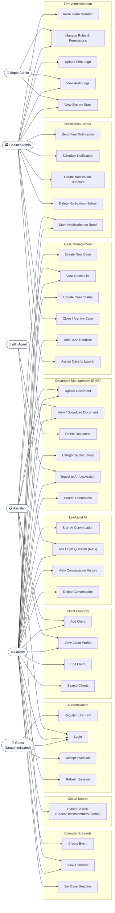

# Use Case Diagram — LexManage

```mermaid
flowchart LR
    %% Actors
    Guest(["👤 Guest\n(Unauthenticated)"])
    Admin(["🏛️ Cabinet Admin"])
    Lawyer(["⚖️ Lawyer"])
    Assistant(["📋 Assistant"])
    SuperAdmin(["🔐 Super Admin"])
    n8n(["🤖 n8n Agent"])

    %% ── Guest ────────────────────────────────────────────────
    subgraph UC_AUTH ["Authentication"]
        UC1["Register Law Firm"]
        UC2["Login"]
        UC3["Accept Invitation"]
        UC4["Refresh Session"]
    end

    %% ── Case Management ──────────────────────────────────────
    subgraph UC_CASES ["Case Management"]
        UC5["Create New Case"]
        UC6["View Cases List"]
        UC7["Update Case Status"]
        UC8["Close / Archive Case"]
        UC9["Add Case Deadline"]
        UC10["Assign Case to Lawyer"]
    end

    %% ── Document Management ──────────────────────────────────
    subgraph UC_DOCS ["Document Management (DMS)"]
        UC11["Upload Document"]
        UC12["View / Download Document"]
        UC13["Delete Document"]
        UC14["Categorize Document"]
        UC15["Ingest to AI (LexAssist)"]
        UC16["Search Documents"]
    end

    %% ── Client Directory ──────────────────────────────────────
    subgraph UC_CLIENTS ["Client Directory"]
        UC17["Add Client"]
        UC18["View Client Profile"]
        UC19["Edit Client"]
        UC20["Search Clients"]
    end

    %% ── Notifications ─────────────────────────────────────────
    subgraph UC_NOTIF ["Notification Center"]
        UC21["Send Firm Notification"]
        UC22["Schedule Notification"]
        UC23["Create Notification Template"]
        UC24["Delete Notification History"]
        UC25["Mark Notification as Read"]
    end

    %% ── AI Assistant ──────────────────────────────────────────
    subgraph UC_AI ["LexAssist AI"]
        UC26["Start AI Conversation"]
        UC27["Ask Legal Question (RAG)"]
        UC28["View Conversation History"]
        UC29["Delete Conversation"]
    end

    %% ── Calendar ──────────────────────────────────────────────
    subgraph UC_CAL ["Calendar & Events"]
        UC30["Create Event"]
        UC31["View Calendar"]
        UC32["Set Case Deadline"]
    end

    %% ── Search ────────────────────────────────────────────────
    subgraph UC_SEARCH ["Global Search"]
        UC33["Hybrid Search (Cases/Docs/Members/Clients)"]
    end

    %% ── Admin ─────────────────────────────────────────────────
    subgraph UC_ADMIN ["Firm Administration"]
        UC34["Invite Team Member"]
        UC35["Manage Roles & Permissions"]
        UC36["Upload Firm Logo"]
        UC37["View Audit Logs"]
        UC38["View System Stats"]
    end

    %% ── Connections: Guest ────────────────────────────────────
    Guest --> UC1
    Guest --> UC2
    Guest --> UC3

    %% ── Connections: All authenticated users ──────────────────
    Lawyer --> UC2
    Lawyer --> UC4
    Lawyer --> UC5
    Lawyer --> UC6
    Lawyer --> UC7
    Lawyer --> UC9
    Lawyer --> UC11
    Lawyer --> UC12
    Lawyer --> UC14
    Lawyer --> UC15
    Lawyer --> UC16
    Lawyer --> UC17
    Lawyer --> UC18
    Lawyer --> UC19
    Lawyer --> UC20
    Lawyer --> UC25
    Lawyer --> UC26
    Lawyer --> UC27
    Lawyer --> UC28
    Lawyer --> UC29
    Lawyer --> UC30
    Lawyer --> UC31
    Lawyer --> UC32
    Lawyer --> UC33

    %% ── Connections: Assistant (subset of Lawyer) ─────────────
    Assistant --> UC2
    Assistant --> UC6
    Assistant --> UC11
    Assistant --> UC12
    Assistant --> UC17
    Assistant --> UC18
    Assistant --> UC25
    Assistant --> UC31

    %% ── Connections: Admin (extends Lawyer) ───────────────────
    Admin --> UC8
    Admin --> UC10
    Admin --> UC13
    Admin --> UC21
    Admin --> UC22
    Admin --> UC23
    Admin --> UC24
    Admin --> UC34
    Admin --> UC35
    Admin --> UC36
    Admin --> UC37
    Admin --> UC38

    %% ── Connections: Super Admin (extends Admin) ──────────────
    SuperAdmin --> UC37
    SuperAdmin --> UC38
    SuperAdmin --> UC35

    %% ── Connections: n8n Agent ────────────────────────────────
    n8n --> UC15
    n8n --> UC27

    %% Styles
    classDef actor fill:#f8fafc,stroke:#475569,color:#0f172a,rx:50
    classDef usecase fill:#fef3c7,stroke:#d97706,color:#1c1917
    class Guest,Admin,Lawyer,Assistant,SuperAdmin,n8n actor
```
