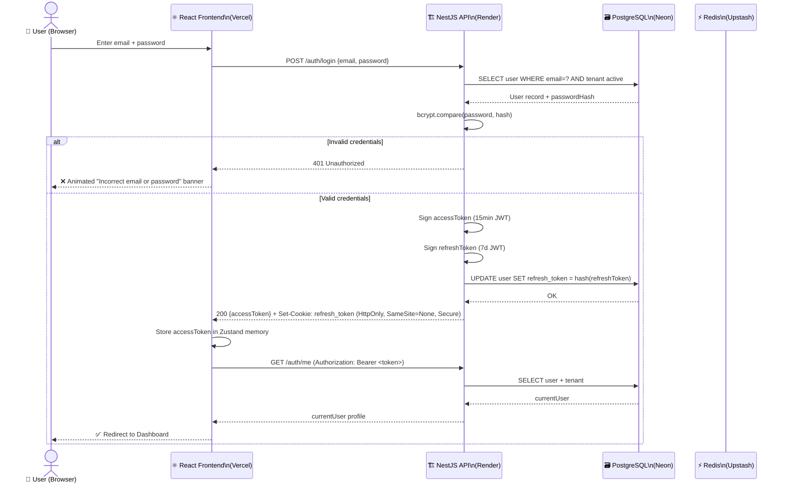
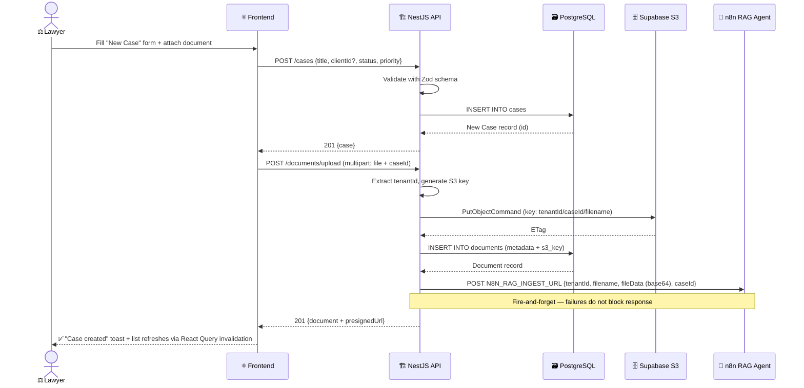
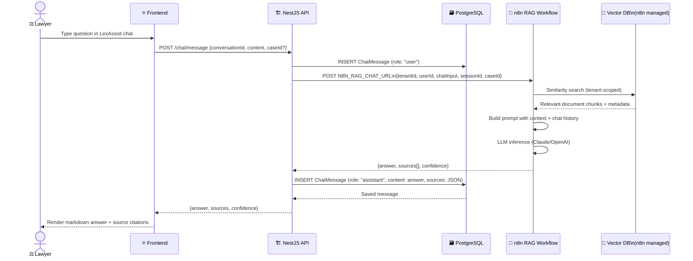
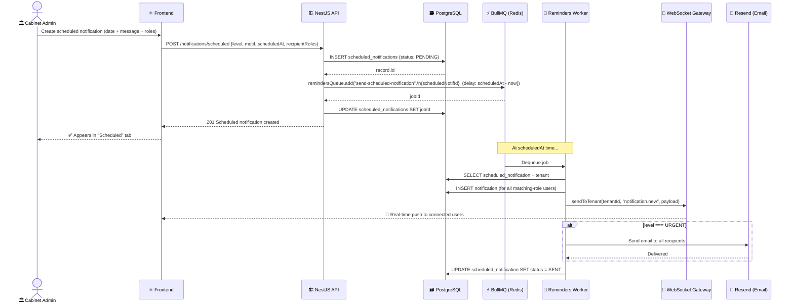

# Sequence Diagrams — LexManage

## Sequence 1 — User Login & Session Initialization

---

## Sequence 2 — Create Case & Upload Document

---

## Sequence 3 — LexAssist AI Chat (RAG)

---

## Sequence 4 — Scheduled Notification

