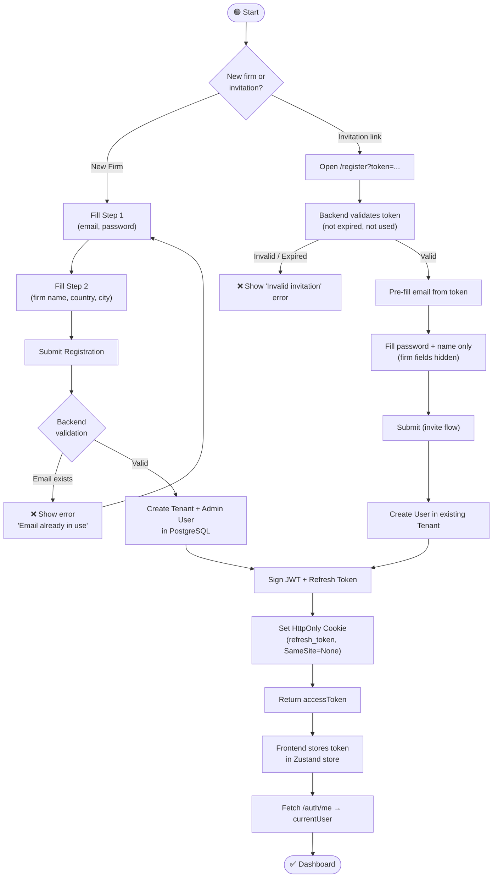
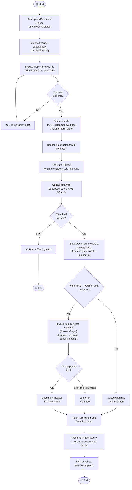
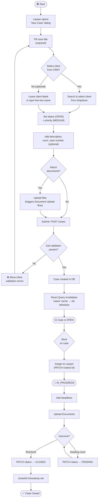
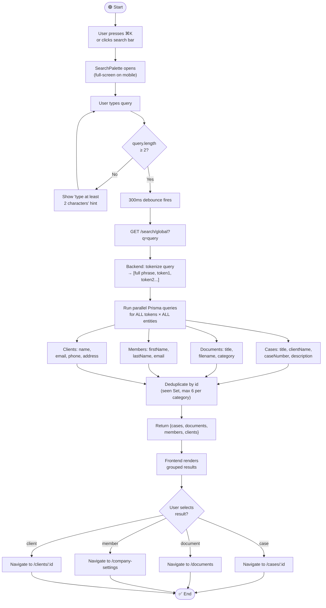

# Activity Diagrams — LexManage

## Activity 1 — User Registration & Onboarding

---

## Activity 2 — Document Upload & AI Ingestion

---

## Activity 3 — Case Lifecycle Management

---

## Activity 4 — Hybrid Global Search

