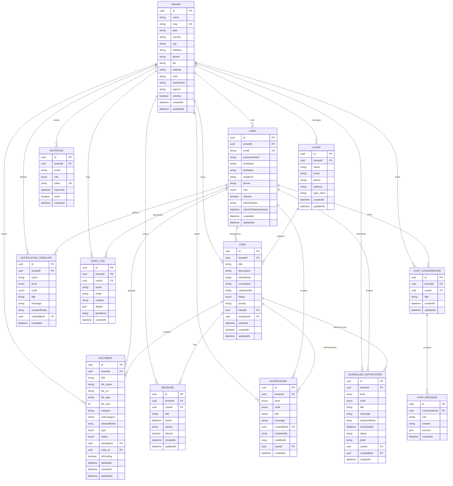

# Entity-Relationship Diagram — LexManage

---

## Enum Reference

| Enum | Values |
|------|--------|
| **Role** | `SUPER_ADMIN`, `CABINET_ADMIN`, `LAWYER`, `ASSISTANT`, `SECRETARY` |
| **CaseStatus** | `OPEN`, `IN_PROGRESS`, `PENDING`, `CLOSED`, `ARCHIVED` |
| **NotificationLevel** | `NORMAL`, `IMPORTANT`, `URGENT` |
| **NotificationMotif** | `HEARING`, `INTERNAL_MEETING`, `DEADLINE`, `DOCUMENT_TO_SIGN`, `NEW_CLIENT`, `INVOICE_PENDING`, `LEGAL_UPDATE`, `INTERNAL_REMINDER`, `CONFLICT_DETECTED`, `OTHER` |
| **DocumentStatus** | `UPLOADED`, `OCR_PENDING`, `OCR_DONE`, `INDEXED`, `ERROR` |
| **DocumentType** | `SUMMONS`, `SUBPOENA`, `LEGAL_BRIEF`, `MEMORANDUM`, `MOTION`, `COURT_ORDER`, `JUDGMENT`, `HEARING_TRANSCRIPT`, `INVOICE`, `EXHIBIT`, `NDA`, `CONTRACT`, `OTHER` (+ 40 more) |
